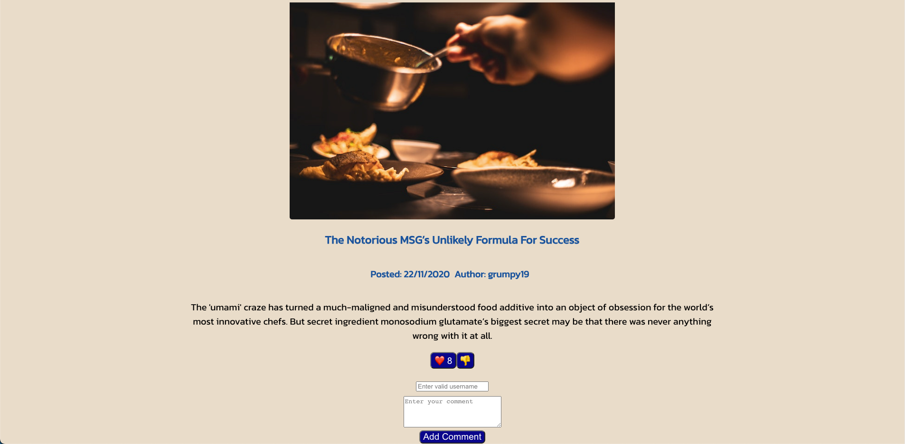

# **News Yourself In The Moment**

## <ins>Summary</ins>

This project is part of my portfolio whilst enrolled on the NorthCoders Software Engineering bootcamp.  

Essentially, It is a news website built using JavaScript & React & is the front-end piece for my back-end RESTful API that was created using Express & PostgreSQL during the back-end phase of the bootcamp.

**Please note: The app is still a W.I.P as not all the endpoints from the API are connected to this app.**

Current working functionality: View a list of articles, View an individual article, Up vote on an article, Down vote on an article, Add a new comment on an article, View a list of topics, View a list of articles associated with each topic.

---

## <ins>Hosted Version</ins>

Can be found here - https://news-control.netlify.app/

---

## <ins>Screenshots</ins>

---

## <ins>Tech Stack</ins>

- CSS
- JavaScript
- React

---

## <ins>Local Setup</ins>

1. To clone the repo, open up your terminal and run git clone https://github.com/mandeep-s1ngh/nc-news.git - once you have it cloned, move the folder to your usual directory for projects (if necessary).

2. You can then open up the folder in your code editor of choice and run `npm install` to install all the dependencies.

3. Then run `npm run dev`. This will start the app in development and keep it running in the background whilst you make any changes.

---

## <ins>Back-end API Repo</ins>

https://github.com/mandeep-s1ngh/be-nc-news

The README for this repo contains the link to the hosted version of the API as well as instructions on how to view the available list of endpoints (in a nicely presented layout) associated with it.
